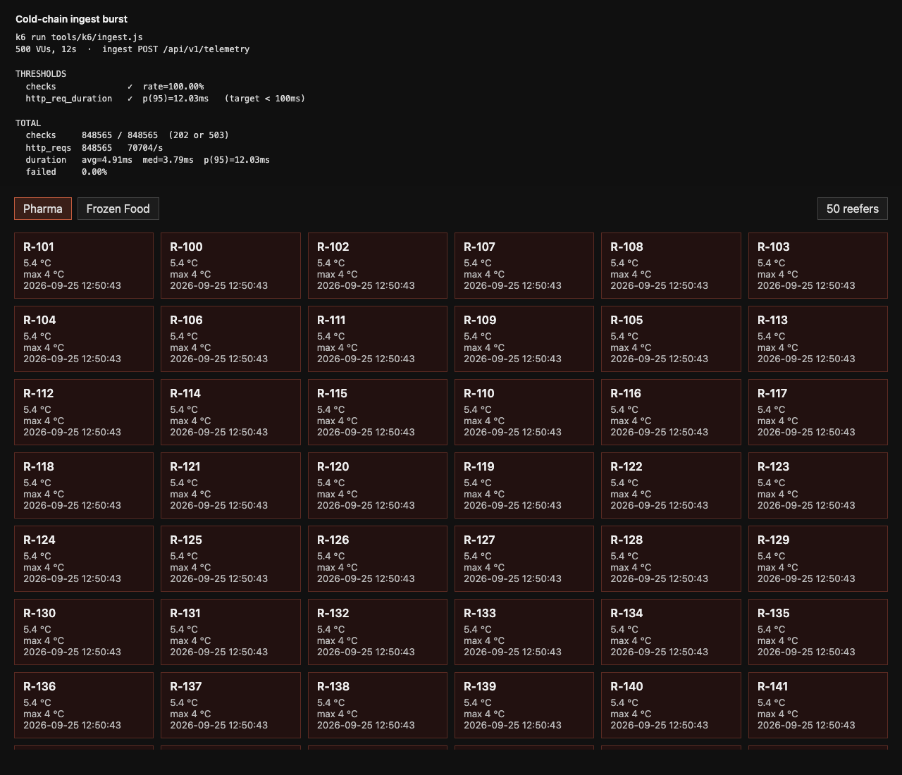

# Cold-Chain Gateway

ASP.NET Core service for refrigerated-container telemetry.

```bash
dotnet run --project src/ColdChain.Gateway --launch-profile http
```

Dispatcher (needs the gateway):

```bash
cd web/dispatcher && npm start
```

500 concurrent posts against ingest (install [k6](https://k6.io) first):

```bash
k6 run tools/k6/ingest.js
```

p95 on the ingest request stayed under 100 ms; the board kept ticking.


